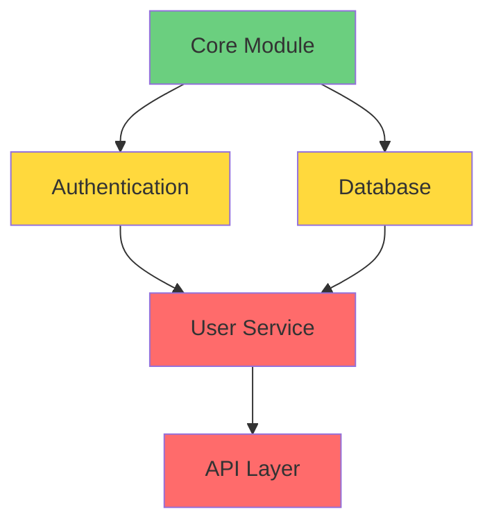

# 🏗️ ArchLens - Advanced Architecture Analysis Tool

<div align="center">


[](https://www.rust-lang.org/)
[](https://opensource.org/licenses/MIT)
[](https://github.com)
[](https://modelcontextprotocol.io/)

**🔍 Intelligent code architecture analysis with AI-powered insights**

*Discover code smells, architectural antipatterns, and technical debt in your projects*

[📖 Documentation](#-documentation) • [🚀 Quick Start](#-quick-start) • [🤖 AI Integration](#-ai-integration) • [🌍 Русский](README_RU.md)

</div>

---

## 🌟 Features

### 🔍 **Deep Code Analysis**
- **Code Smells Detection**: Long methods, magic numbers, code duplication
- **SOLID Principles**: Violations of single responsibility, open/closed principles
- **Architectural Antipatterns**: God Objects, tight coupling, circular dependencies
- **Quality Metrics**: Cyclomatic complexity, cognitive complexity, maintainability index

### 🏗️ **Architecture Insights**
- **Project Structure**: Hierarchical analysis with layer detection
- **Dependency Mapping**: Import/export relationships and circular dependencies
- **Technical Debt**: Quantified debt assessment with refactoring recommendations
- **Risk Assessment**: Automated architectural risk evaluation

### 🤖 **AI-Ready Output**
- **MCP Server (Rust)**: Official STDIO and Streamable HTTP transports with JSON Schema publishing
- **Structured Reports**: JSON/Markdown exports optimized for AI consumption
- **Interactive Diagrams**: Mermaid diagrams for visual architecture representation
- **Context-Rich**: Detailed explanations suitable for AI-assisted refactoring

### 🛠️ **Developer Experience**
- **Multi-Language**: Rust, TypeScript, JavaScript, Python, Java, Go, C/C++
- **Cross-Platform**: Windows, macOS, Linux support
- **CLI & API**: Command-line interface and programmatic access
- **No Admin Rights**: Works without elevated permissions

---

## 🚀 Quick Start

### 📦 Installation

#### Option 1: Download Binary
```bash
# Download latest release
curl -L https://github.com/yourusername/archlens/releases/latest/download/archlens-x86_64-pc-windows-msvc.zip -o archlens.zip
unzip archlens.zip
```

#### Option 2: Build from Source
```bash
# Clone repository
git clone https://github.com/yourusername/archlens.git
cd archlens

# Build release version
cargo build --release

# Binary will be available at ./target/release/archlens
```

### 🔍 Basic Usage

#### 📊 Project Analysis
```bash
# Analyze current directory
./archlens analyze .

# Analyze specific project
./archlens analyze /path/to/project

# Verbose analysis with dependencies
./archlens analyze . --verbose --analyze-dependencies
```

#### 📁 Project Structure
```bash
# Get project structure overview
./archlens structure .

# Include detailed metrics
./archlens structure . --show-metrics
```

#### 🤖 AI-Ready Export
```bash
# Export comprehensive analysis for AI (summary detail level by default)
./archlens export . ai_compact

# Save to file
./archlens export . ai_compact --output analysis.md

# Request full verbosity via MCP (detail_level=full) to avoid token clipping
```

#### 📈 Architecture Diagram
   ```bash
# Generate Mermaid diagram
./archlens diagram . mermaid

# Generate with quality metrics
./archlens diagram . mermaid --include-metrics
```

---

## 🤖 AI Integration

### 🔌 MCP Server (Model Context Protocol, Rust)

ArchLens includes a powerful MCP server for seamless AI assistant integration:

- Accepts absolute and relative paths ('.', './src') — resolved to absolute safely.
- `detail_level`: summary (default) | standard | full. Compact by default to minimize tokens without losing signal.
- CLI deep pipeline: `./archlens analyze . --deep` (scan → AST → capsules → graph → validators).
- Rust MCP binary: `archlens-mcp` with STDIO JSON-RPC and HTTP endpoints (POST/SSE).
  - STDIO methods: `tools/list`, `tools/call`, `resources/list`, `prompts/list`
  - HTTP endpoints: `/export/ai_compact`, `/structure/get`, `/diagram/generate`, `/sse/refresh`, `/schemas/list`

#### 🛠️ Setup with Claude Desktop

1. **Configure MCP Settings** (`~/.config/claude-desktop/mcp_settings.json`):
   ```json
   {
  "mcpServers": {
       "archlens": {
         "command": "node",
      "args": ["/path/to/archlens/mcp/archlens_mcp_server.cjs"],
      "env": {
        "ARCHLENS_DEBUG": "false"
      }
       }
     }
   }
   ```

2. **Restart Claude Desktop**

3. **Use AI-Powered Analysis**:
   - `analyze_project` - Quick project overview
   - `export_ai_compact` - Comprehensive AI analysis
   - `get_project_structure` - Detailed structure mapping
   - `generate_diagram` - Visual architecture diagrams

#### 🎯 AI Commands

| Command | Description | Use Case |
|---------|-------------|----------|
| 🔍 `analyze_project` | Basic project statistics and risk assessment | Initial project evaluation |
| 🤖 `export_ai_compact` | Full architecture analysis (~2800 tokens) | Deep AI-assisted refactoring |
| 📁 `get_project_structure` | Hierarchical structure with metrics | Understanding project organization |
| 📊 `generate_diagram` | Mermaid architecture diagrams | Visual documentation |

---

## 📖 Documentation

### 🔧 Command Reference

#### `analyze` - Project Analysis
```bash
archlens analyze <path> [OPTIONS]

OPTIONS:
    --verbose                 Detailed output with warnings
    --analyze-dependencies    Analyze module dependencies
    --extract-comments        Extract and analyze documentation
    --include-patterns <PATTERNS>  File patterns to include
    --exclude-patterns <PATTERNS>  File patterns to exclude
    --max-depth <DEPTH>       Maximum directory depth
```

#### `structure` - Project Structure
```bash
archlens structure <path> [OPTIONS]

OPTIONS:
    --show-metrics           Include file metrics
    --max-files <COUNT>      Maximum files in output
```

#### `export` - Export Analysis
```bash
archlens export <path> <format> [OPTIONS]

FORMATS:
    ai_compact              AI-optimized comprehensive analysis
    json                    Raw JSON data
    markdown                Human-readable markdown

OPTIONS:
    --output <FILE>         Output file path
    --focus-critical        Show only critical problems
    --include-diff          Include degradation analysis
```

#### `diagram` - Generate Diagrams
```bash
archlens diagram <path> <type> [OPTIONS]

TYPES:
    mermaid                 Mermaid diagram syntax
    svg                     SVG vector graphics
    dot                     Graphviz DOT format

OPTIONS:
    --include-metrics       Include quality metrics
    --output <FILE>         Output file path
```

### 🧠 AI Compact Sections
- Summary: totals and average complexity
- Problems (Heuristic): graph-level coupling/cohesion/complexity
- Problems (Validated): validator warnings by category with top components and severity H/M/L
- Cycles (Top): top cycles by length
- Top Coupling: hub components by degree
- Top Complexity Components: top-10 by complexity

### 🎨 Output Examples

#### 📊 Analysis Report
```markdown
# 🔍 PROJECT ANALYSIS BRIEF

**Path:** /your/project
**Analysis performed:** 2024-01-15, 14:30:22

## 📊 Key metrics
- **Total files:** 127
- **Lines of code:** 15,432
- **Technical debt:** 23.5%

## 🗂️ File distribution
- **.rs**: 45 file(s)
- **.ts**: 32 file(s)
- **.js**: 28 file(s)

## 📈 Architectural assessment
⚠️ **MEDIUM PROJECT** (127 files)
- Manageable size, moderate architectural risks
- Possible circular dependencies detected
```

#### 📈 Mermaid Diagram


---

## 🏗️ Architecture

### 🔧 Core Components

```
src/
├── 🧠 analysis/          # Core analysis engine
│   ├── file_scanner.rs   # Multi-language file scanning
│   ├── parser_ast.rs     # AST parsing and analysis
│   └── metadata_extractor.rs # Code metadata extraction
├── 🏗️ architecture/      # Architecture analysis
│   ├── capsule_constructor.rs # Component modeling
│   ├── graph_builder.rs  # Dependency graph construction
│   └── enricher.rs       # Quality metrics calculation
├── 📊 metrics/           # Quality assessment
│   ├── code_smells.rs    # Code smell detection
│   ├── complexity.rs     # Complexity metrics
│   └── tech_debt.rs      # Technical debt analysis
├── 📤 export/            # Output generation
│   ├── ai_compact.rs     # AI-optimized exports
│   ├── diagrams.rs       # Visual diagram generation
│   └── reports.rs        # Human-readable reports
└── 🔌 mcp/              # MCP server integration
    └── archlens_mcp_server.cjs # Node.js MCP server
```

### 🔄 Analysis Pipeline

1. **📁 File Discovery** - Recursive project scanning with pattern matching
2. **🔍 AST Parsing** - Language-specific syntax tree analysis
3. **🏗️ Component Modeling** - Architecture component extraction
4. **📊 Metrics Calculation** - Quality and complexity assessment
5. **🤖 AI Export** - Structured output for AI consumption

---

## 🛠️ Development

### 🔧 Building

```bash
# Development build
cargo build

# Release build with optimizations
cargo build --release

# Run tests
cargo test

# Run with logging
RUST_LOG=debug cargo run -- analyze .
```

### 🧪 Testing

```bash
# Run all tests
cargo test

# Test specific module
cargo test file_scanner

# Test with output
cargo test -- --nocapture
```

### 📝 Contributing

See [CONTRIBUTING.md](CONTRIBUTING.md) for development guidelines.

---

## 🎯 Use Cases

### 🔍 **Code Review Automation**
- Pre-commit architecture validation
- Pull request quality assessment
- Automated code smell detection

### 🤖 **AI-Assisted Refactoring**
- Context-rich analysis for AI assistants
- Structured refactoring recommendations
- Technical debt prioritization

### 📊 **Technical Debt Management**
- Quantified debt assessment
- Refactoring impact analysis
- Long-term architecture planning

### 🏗️ **Architecture Documentation**
- Automated diagram generation
- Component relationship mapping
- Architectural decision tracking

---

## 🌍 Language Support

| Language | Parsing | Metrics | Dependencies |
|----------|---------|---------|--------------|
| 🦀 **Rust** | ✅ Full | ✅ Complete | ✅ Cargo.toml |
| 📘 **TypeScript** | ✅ Full | ✅ Complete | ✅ package.json |
| 📙 **JavaScript** | ✅ Full | ✅ Complete | ✅ package.json |
| 🐍 **Python** | ✅ Full | ✅ Complete | ✅ requirements.txt |
| ☕ **Java** | ✅ Basic | ✅ Complete | ⚠️ Partial |
| 🐹 **Go** | ✅ Basic | ✅ Complete | ✅ go.mod |
| ⚡ **C/C++** | ✅ Basic | ✅ Complete | ⚠️ Partial |

---

## 📊 Metrics & Analysis

### 🎯 **Quality Metrics**
- **Cyclomatic Complexity** - Control flow complexity measurement
- **Cognitive Complexity** - Human comprehension difficulty
- **Maintainability Index** - Overall maintainability score
- **Technical Debt Ratio** - Percentage of problematic code

### 🔍 **Code Smells (20+ Types)**
- **Long Methods** - Functions exceeding complexity thresholds
- **God Objects** - Classes with excessive responsibilities
- **Magic Numbers** - Unexplained numeric constants
- **Code Duplication** - Repeated code patterns
- **Dead Code** - Unreachable or unused code

### 🏗️ **Architectural Patterns**
- **Layer Separation** - Clean architecture validation
- **Dependency Direction** - Proper dependency flow
- **Circular Dependencies** - Problematic dependency cycles
- **Interface Segregation** - SOLID principles compliance

---

## ⚙️ Configuration

### 🔧 Environment Variables

```bash
# MCP Server Configuration
export ARCHLENS_DEBUG=true           # Enable debug logging
export ARCHLENS_BINARY=archlens      # Custom binary name
export ARCHLENS_PATH=/custom/path    # Custom binary path
export ARCHLENS_WORKDIR=/work/dir    # Working directory

# Analysis Configuration
export ARCHLENS_MAX_DEPTH=10         # Maximum scan depth
export ARCHLENS_MAX_FILES=1000       # File limit
export ARCHLENS_LANG=en              # Output language
```

### 📁 Project Configuration

Create `.archlens.toml` in your project root:

```toml
[analysis]
max_depth = 10
include_patterns = ["**/*.rs", "**/*.ts"]
exclude_patterns = ["**/target/**", "**/node_modules/**"]

[quality]
complexity_threshold = 10
method_length_threshold = 50
class_length_threshold = 500

[export]
default_format = "ai_compact"
include_metrics = true
focus_critical = false
```

---

## 🚀 Roadmap

### 🎯 **Version 1.1** (Q2 2024)
- [ ] 🔌 VS Code extension
- [ ] 📊 Web dashboard
- [ ] 🤖 GitHub Actions integration
- [ ] 📈 Trend analysis

### 🎯 **Version 1.2** (Q3 2024)
- [ ] 🌐 Multi-repository analysis
- [ ] 🔄 Continuous monitoring
- [ ] 📱 Mobile-friendly reports
- [ ] 🎨 Custom themes

### 🎯 **Version 2.0** (Q4 2024)
- [ ] 🧠 ML-powered recommendations
- [ ] 🔮 Predictive analysis
- [ ] 🌍 Cloud deployment
- [ ] 🤝 Team collaboration features

---

## 📄 License

This project is licensed under the MIT License - see the [LICENSE](LICENSE) file for details.

---

## 🤝 Contributing

We welcome contributions! Please see [CONTRIBUTING.md](CONTRIBUTING.md) for guidelines.

### 🌟 Contributors

<div align="center">

[](CONTRIBUTING.md)

*Join our growing community of developers improving code architecture analysis!*

</div>

---

## 🔗 Links

- 📖 [Documentation](https://github.com/yourusername/archlens/wiki)
- 🐛 [Issue Tracker](https://github.com/yourusername/archlens/issues)
- 💬 [Discussions](https://github.com/yourusername/archlens/discussions)
- 📧 [Contact](mailto:contact@archlens.dev)

---

<div align="center">

**🏗️ Built with ❤️ for better software architecture**

[](https://www.rust-lang.org/)
[](https://openai.com/)
[](https://opensource.org/)

*Star ⭐ this repository if you find it helpful!*

</div> 

## 🔌 MCP Server (Rust) Quick Start

- Build: `cargo build --release --bin archlens-mcp`
- Transports:
  - STDIO (JSON‑RPC): methods `tools/list`, `tools/call`, `resources/list`, `resources/read`, `prompts/list`, `prompts/get`
  - Streamable HTTP (POST/SSE): `POST /export/ai_compact`, `POST /structure/get`, `POST /diagram/generate`, `GET /sse/refresh`, `GET /schemas/list`, `POST /schemas/read`
- detail_level: `summary` (default) | `standard` | `full` — controls verbosity and token budget

Examples

STDIO (send lines to stdin):

```json
{"jsonrpc":"2.0","id":1,"method":"tools/list"}
{"jsonrpc":"2.0","id":2,"method":"tools/call","params":{"name":"export.ai_compact","arguments":{"project_path":".","detail_level":"summary"}}}
```

HTTP (default port 5178):

```bash
# AI‑compact (summary)
curl -s -X POST localhost:5178/export/ai_compact -H 'content-type: application/json' -d '{"project_path":".","detail_level":"summary"}'

# Structure (standard)
curl -s -X POST localhost:5178/structure/get -H 'content-type: application/json' -d '{"project_path":".","detail_level":"standard"}'

# Diagram (full)
curl -s -X POST localhost:5178/diagram/generate -H 'content-type: application/json' -d '{"project_path":".","diagram_type":"mermaid","detail_level":"full"}'

# Schemas
curl -s localhost:5178/schemas/list | jq
```

Cursor/Claude (STDIO) config snippet:

```json
{
  "mcpServers": {
    "archlens": {
      "command": "/absolute/path/to/target/release/archlens-mcp",
      "env": { "ARCHLENS_DEBUG": "false" }
    }
  }
}
``` 