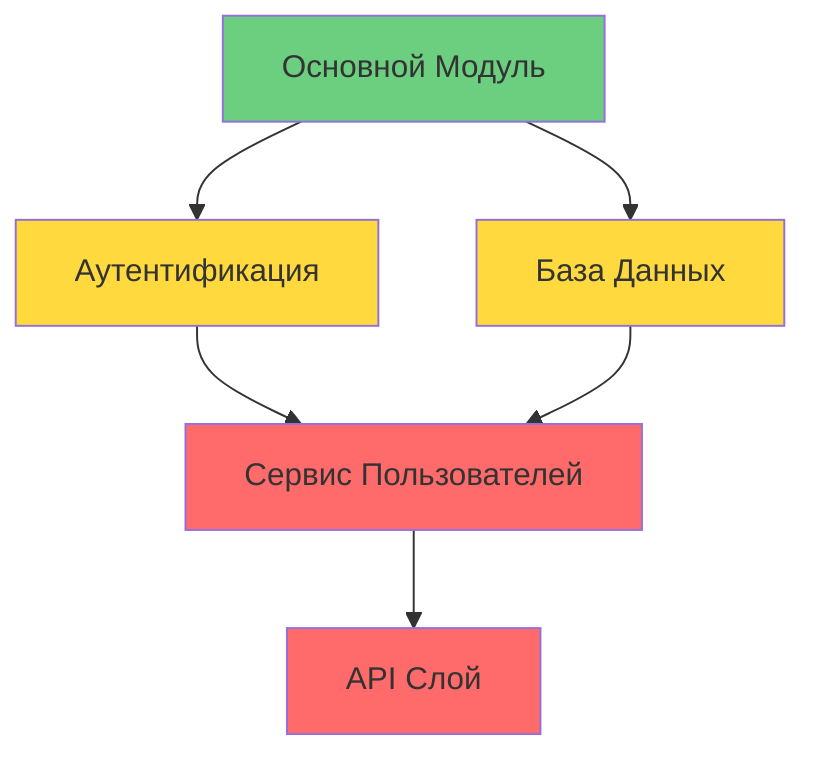

# 🏗️ ArchLens - Продвинутый Инструмент Анализа Архитектуры

<div align="center">


[](https://www.rust-lang.org/)
[](https://opensource.org/licenses/MIT)
[](https://github.com)
[](https://modelcontextprotocol.io/)

**🔍 Интеллектуальный анализ архитектуры кода с поддержкой ИИ**

*Обнаруживайте запахи кода, архитектурные антипаттерны и технический долг в ваших проектах*

[📖 Документация](#-документация) • [🚀 Быстрый Старт](#-быстрый-старт) • [🤖 Интеграция с ИИ](#-интеграция-с-ии) • [🌍 English](README.md)

</div>

---

## 🌟 Возможности

### 🔍 **Глубокий Анализ Кода**
- **Обнаружение Запахов Кода**: Длинные методы, магические числа, дублирование кода
- **Принципы SOLID**: Нарушения принципа единственной ответственности, открытости/закрытости
- **Архитектурные Антипаттерны**: Божественные объекты, тесная связанность, циклические зависимости
- **Метрики Качества**: Цикломатическая сложность, когнитивная сложность, индекс сопровождаемости

### 🏗️ **Архитектурные Инсайты**
- **Структура Проекта**: Иерархический анализ с определением слоев
- **Карта Зависимостей**: Связи импортов/экспортов и циклические зависимости
- **Технический Долг**: Количественная оценка долга с рекомендациями по рефакторингу
- **Оценка Рисков**: Автоматизированная оценка архитектурных рисков

### 🤖 **Готовность к ИИ**
- **MCP Сервер**: Прямая интеграция с Claude и другими ИИ-ассистентами
- **Структурированные Отчеты**: JSON/Markdown экспорты, оптимизированные для ИИ
- **Интерактивные Диаграммы**: Mermaid диаграммы для визуального представления архитектуры
- **Богатый Контекст**: Подробные объяснения, подходящие для ИИ-рефакторинга

### 🛠️ **Опыт Разработчика**
- **Мультиязычность**: Rust, TypeScript, JavaScript, Python, Java, Go, C/C++
- **Кроссплатформенность**: Поддержка Windows, macOS, Linux
- **CLI и API**: Интерфейс командной строки и программный доступ
- **Без Прав Администратора**: Работает без повышенных привилегий

---

## 🚀 Быстрый Старт

### 📦 Установка

#### Вариант 1: Скачать Бинарный Файл
```bash
# Скачать последний релиз
curl -L https://github.com/yourusername/archlens/releases/latest/download/archlens-x86_64-pc-windows-msvc.zip -o archlens.zip
unzip archlens.zip
```

#### Вариант 2: Сборка из Исходников
```bash
# Клонировать репозиторий
git clone https://github.com/yourusername/archlens.git
cd archlens

# Собрать релизную версию
cargo build --release

# Бинарный файл будет доступен в ./target/release/archlens
```

### 🔍 Базовое Использование

#### 📊 Анализ Проекта
```bash
# Анализ текущей директории
./archlens analyze .

# Анализ конкретного проекта
./archlens analyze /path/to/project

# Подробный анализ с зависимостями
./archlens analyze . --verbose --analyze-dependencies
```

#### 📁 Структура Проекта
```bash
# Получить обзор структуры проекта
./archlens structure .

# Включить детальные метрики
./archlens structure . --show-metrics
```

#### 🤖 Экспорт для ИИ
```bash
# Экспорт комплексного анализа для ИИ
./archlens export . ai_compact

# Сохранить в файл
./archlens export . ai_compact --output analysis.md
```

#### 📈 Диаграмма Архитектуры
```bash
# Генерация Mermaid диаграммы
./archlens diagram . mermaid

# Генерация с метриками качества
./archlens diagram . mermaid --include-metrics
```

---

## 🤖 Интеграция с ИИ

### 🔌 MCP Сервер (Model Context Protocol)

ArchLens включает мощный MCP сервер для бесшовной интеграции с ИИ-ассистентами:

#### 🛠️ Настройка с Claude Desktop

1. **Настройка MCP** (`~/.config/claude-desktop/mcp_settings.json`):
```json
{
  "mcpServers": {
    "archlens": {
      "command": "node",
      "args": ["/path/to/archlens/mcp/archlens_mcp_server.cjs"],
      "env": {
        "ARCHLENS_DEBUG": "false"
      }
    }
  }
}
```

2. **Перезапустить Claude Desktop**

3. **Использовать ИИ-анализ**:
   - `analyze_project` - Быстрый обзор проекта
   - `export_ai_compact` - Комплексный ИИ-анализ
   - `get_project_structure` - Детальное картирование структуры
   - `generate_diagram` - Визуальные архитектурные диаграммы

#### 🎯 ИИ Команды

| Команда | Описание | Случай Использования |
|---------|----------|---------------------|
| 🔍 `analyze_project` | Базовая статистика проекта и оценка рисков | Первоначальная оценка проекта |
| 🤖 `export_ai_compact` | Полный архитектурный анализ (~2800 токенов) | Глубокий ИИ-рефакторинг |
| 📁 `get_project_structure` | Иерархическая структура с метриками | Понимание организации проекта |
| 📊 `generate_diagram` | Mermaid архитектурные диаграммы | Визуальная документация |

---

## 📖 Документация

### 🔧 Справочник Команд

#### `analyze` - Анализ Проекта
```bash
archlens analyze <путь> [ОПЦИИ]

ОПЦИИ:
    --verbose                 Подробный вывод с предупреждениями
    --analyze-dependencies    Анализ зависимостей модулей
    --extract-comments        Извлечение и анализ документации
    --include-patterns <ШАБЛОНЫ>  Шаблоны файлов для включения
    --exclude-patterns <ШАБЛОНЫ>  Шаблоны файлов для исключения
    --max-depth <ГЛУБИНА>     Максимальная глубина директорий
```

#### `structure` - Структура Проекта
```bash
archlens structure <путь> [ОПЦИИ]

ОПЦИИ:
    --show-metrics           Включить метрики файлов
    --max-files <КОЛИЧЕСТВО> Максимум файлов в выводе
```

#### `export` - Экспорт Анализа
```bash
archlens export <путь> <формат> [ОПЦИИ]

ФОРМАТЫ:
    ai_compact              ИИ-оптимизированный комплексный анализ
    json                    Сырые JSON данные
    markdown                Читаемый человеком markdown

ОПЦИИ:
    --output <ФАЙЛ>         Путь к выходному файлу
    --focus-critical        Показать только критические проблемы
    --include-diff          Включить анализ деградации
```

#### `diagram` - Генерация Диаграмм
```bash
archlens diagram <путь> <тип> [ОПЦИИ]

ТИПЫ:
    mermaid                 Синтаксис Mermaid диаграмм
    svg                     SVG векторная графика
    dot                     Формат Graphviz DOT

ОПЦИИ:
    --include-metrics       Включить метрики качества
    --output <ФАЙЛ>         Путь к выходному файлу
```

### 🎨 Примеры Вывода

#### 📊 Отчет Анализа
```markdown
# 🔍 КРАТКИЙ АНАЛИЗ ПРОЕКТА

**Путь:** /ваш/проект
**Анализ выполнен:** 15.01.2024, 14:30:22

## 📊 Ключевые метрики
- **Всего файлов:** 127
- **Строк кода:** 15,432
- **Технический долг:** 23.5%

## 🗂️ Распределение файлов
- **.rs**: 45 файл(ов)
- **.ts**: 32 файл(ов)
- **.js**: 28 файл(ов)

## 📈 Архитектурная оценка
⚠️ **СРЕДНИЙ ПРОЕКТ** (127 файлов)
- Управляемый размер, умеренные архитектурные риски
- Возможны циклические зависимости
```

#### 📈 Mermaid Диаграмма


---

## 🏗️ Архитектура

### 🔧 Основные Компоненты

```
src/
├── 🧠 analysis/          # Ядро анализа
│   ├── file_scanner.rs   # Многоязычное сканирование файлов
│   ├── parser_ast.rs     # Парсинг и анализ AST
│   └── metadata_extractor.rs # Извлечение метаданных кода
├── 🏗️ architecture/      # Анализ архитектуры
│   ├── capsule_constructor.rs # Моделирование компонентов
│   ├── graph_builder.rs  # Построение графа зависимостей
│   └── enricher.rs       # Расчет метрик качества
├── 📊 metrics/           # Оценка качества
│   ├── code_smells.rs    # Обнаружение запахов кода
│   ├── complexity.rs     # Метрики сложности
│   └── tech_debt.rs      # Анализ технического долга
├── 📤 export/            # Генерация вывода
│   ├── ai_compact.rs     # ИИ-оптимизированные экспорты
│   ├── diagrams.rs       # Генерация визуальных диаграмм
│   └── reports.rs        # Читаемые человеком отчеты
└── 🔌 mcp/              # Интеграция MCP
    └── archlens_mcp_server.cjs # Node.js MCP сервер
```

### 🔄 Конвейер Анализа

1. **📁 Обнаружение Файлов** - Рекурсивное сканирование проекта с сопоставлением шаблонов
2. **🔍 Парсинг AST** - Языко-специфичный анализ синтаксических деревьев
3. **🏗️ Моделирование Компонентов** - Извлечение архитектурных компонентов
4. **📊 Расчет Метрик** - Оценка качества и сложности
5. **🤖 Экспорт для ИИ** - Структурированный вывод для потребления ИИ

---

## 🛠️ Разработка

### 🔧 Сборка

```bash
# Сборка для разработки
cargo build

# Релизная сборка с оптимизациями
cargo build --release

# Запуск тестов
cargo test

# Запуск с логированием
RUST_LOG=debug cargo run -- analyze .
```

### 🧪 Тестирование

```bash
# Запуск всех тестов
cargo test

# Тест конкретного модуля
cargo test file_scanner

# Тест с выводом
cargo test -- --nocapture
```

### 📝 Участие в Разработке

См. [CONTRIBUTING.md](CONTRIBUTING.md) для руководства по разработке.

---

## 🎯 Случаи Использования

### 🔍 **Автоматизация Code Review**
- Валидация архитектуры перед коммитом
- Оценка качества pull request'ов
- Автоматическое обнаружение запахов кода

### 🤖 **ИИ-Рефакторинг**
- Богатый контекстом анализ для ИИ-ассистентов
- Структурированные рекомендации по рефакторингу
- Приоритизация технического долга

### 📊 **Управление Техническим Долгом**
- Количественная оценка долга
- Анализ влияния рефакторинга
- Долгосрочное планирование архитектуры

### 🏗️ **Документация Архитектуры**
- Автоматическая генерация диаграмм
- Картирование связей компонентов
- Отслеживание архитектурных решений

---

## 🌍 Поддержка Языков

| Язык | Парсинг | Метрики | Зависимости |
|------|---------|---------|--------------|
| 🦀 **Rust** | ✅ Полная | ✅ Полная | ✅ Cargo.toml |
| 📘 **TypeScript** | ✅ Полная | ✅ Полная | ✅ package.json |
| 📙 **JavaScript** | ✅ Полная | ✅ Полная | ✅ package.json |
| 🐍 **Python** | ✅ Полная | ✅ Полная | ✅ requirements.txt |
| ☕ **Java** | ✅ Базовая | ✅ Полная | ⚠️ Частичная |
| 🐹 **Go** | ✅ Базовая | ✅ Полная | ✅ go.mod |
| ⚡ **C/C++** | ✅ Базовая | ✅ Полная | ⚠️ Частичная |

---

## 📊 Метрики и Анализ

### 🎯 **Метрики Качества**
- **Цикломатическая Сложность** - Измерение сложности потока управления
- **Когнитивная Сложность** - Сложность понимания человеком
- **Индекс Сопровождаемости** - Общий балл сопровождаемости
- **Коэффициент Технического Долга** - Процент проблемного кода

### 🔍 **Запахи Кода (20+ Типов)**
- **Длинные Методы** - Функции, превышающие пороги сложности
- **Божественные Объекты** - Классы с избыточными обязанностями
- **Магические Числа** - Необъясненные числовые константы
- **Дублирование Кода** - Повторяющиеся паттерны кода
- **Мертвый Код** - Недостижимый или неиспользуемый код

### 🏗️ **Архитектурные Паттерны**
- **Разделение Слоев** - Валидация чистой архитектуры
- **Направление Зависимостей** - Правильный поток зависимостей
- **Циклические Зависимости** - Проблемные циклы зависимостей
- **Разделение Интерфейсов** - Соответствие принципам SOLID

---

## ⚙️ Конфигурация

### 🔧 Переменные Окружения

```bash
# Конфигурация MCP Сервера
export ARCHLENS_DEBUG=true           # Включить отладочное логирование
export ARCHLENS_BINARY=archlens      # Пользовательское имя бинарника
export ARCHLENS_PATH=/custom/path    # Пользовательский путь к бинарнику
export ARCHLENS_WORKDIR=/work/dir    # Рабочая директория

# Конфигурация Анализа
export ARCHLENS_MAX_DEPTH=10         # Максимальная глубина сканирования
export ARCHLENS_MAX_FILES=1000       # Лимит файлов
export ARCHLENS_LANG=ru              # Язык вывода
```

### 📁 Конфигурация Проекта

Создайте `.archlens.toml` в корне вашего проекта:

```toml
[analysis]
max_depth = 10
include_patterns = ["**/*.rs", "**/*.ts"]
exclude_patterns = ["**/target/**", "**/node_modules/**"]

[quality]
complexity_threshold = 10
method_length_threshold = 50
class_length_threshold = 500

[export]
default_format = "ai_compact"
include_metrics = true
focus_critical = false
```

---

## 🚀 Дорожная Карта

### 🎯 **Версия 1.1** (Q2 2024)
- [ ] 🔌 Расширение VS Code
- [ ] 📊 Веб-панель
- [ ] 🤖 Интеграция GitHub Actions
- [ ] 📈 Анализ трендов

### 🎯 **Версия 1.2** (Q3 2024)
- [ ] 🌐 Анализ множественных репозиториев
- [ ] 🔄 Непрерывный мониторинг
- [ ] 📱 Мобильные отчеты
- [ ] 🎨 Пользовательские темы

### 🎯 **Версия 2.0** (Q4 2024)
- [ ] 🧠 ML-рекомендации
- [ ] 🔮 Предиктивный анализ
- [ ] 🌍 Облачное развертывание
- [ ] 🤝 Функции командной работы

---

## 📄 Лицензия

Этот проект лицензирован под лицензией MIT - подробности в файле [LICENSE](LICENSE).

---

## 🤝 Участие в Разработке

Мы приветствуем вклад! Пожалуйста, см. [CONTRIBUTING.md](CONTRIBUTING.md) для руководства.

### 🌟 Участники

<div align="center">

[](CONTRIBUTING.md)

*Присоединяйтесь к нашему растущему сообществу разработчиков, улучшающих анализ архитектуры кода!*

</div>

---

## 🔗 Ссылки

- 📖 [Документация](https://github.com/yourusername/archlens/wiki)
- 🐛 [Трекер Проблем](https://github.com/yourusername/archlens/issues)
- 💬 [Обсуждения](https://github.com/yourusername/archlens/discussions)
- 📧 [Контакты](mailto:contact@archlens.dev)

---

<div align="center">

**🏗️ Создано с ❤️ для лучшей архитектуры программного обеспечения**

[](https://www.rust-lang.org/)
[](https://openai.com/)
[](https://opensource.org/)

*Поставьте ⭐ этому репозиторию, если он вам помог!*

</div> 