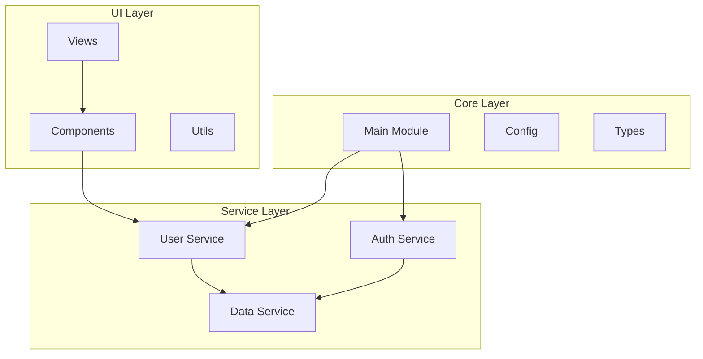

# 🏗️ ArchLens MCP Server - Архитектурный Анализатор для ИИ

**Профессиональный анализ архитектуры кода для AI редакторов (Cursor, VSCode, Claude)**

## 🎯 Основные возможности

### 🤖 AI COMPACT ЭКСПОРТ
- **Сжатый анализ архитектуры** (~2800 токенов) оптимизированный для ИИ
- **Критические проблемы** с приоритизацией
- **Архитектурные паттерны** с уровнем уверенности
- **Метрики качества** и технический долг
- **Структурированные рекомендации**

### 📊 ГЕНЕРАЦИЯ ДИАГРАММ
- **Mermaid диаграммы** с готовым кодом и описанием
- **SVG диаграммы** для визуализации
- **DOT диаграммы** для Graphviz
- **Автоматическое определение** компонентов и связей

### 🔍 ПОЛНЫЙ АНАЛИЗ ПРОЕКТА
- **Комплексный анализ** архитектуры и метрик
- **Детекция паттернов** проектирования
- **Анализ зависимостей** между модулями
- **Оценка сложности** и maintainability

### 📁 СТРУКТУРА ПРОЕКТА
- **Иерархическая структура** файлов и папок
- **Типы файлов** и их распределение
- **Базовые метрики** (размер, строки кода)
- **Архитектурные слои** проекта

## 🚀 Использование

### Настройка в Cursor

1. **Добавьте MCP сервер в конфигурацию Cursor:**
```json
{
  "mcpServers": {
    "archlens": {
      "command": "node",
      "args": ["C:\\path\\to\\archlens\\mcp\\archlens_mcp_server.cjs"],
      "env": {}
    }
  }
}
```

2. **Перезапустите Cursor** для применения изменений

### Использование инструментов

#### 🤖 AI Compact Экспорт
```
Используйте инструмент export_ai_compact для получения сжатого анализа:
- project_path: "." (текущий проект)
- focus_critical_only: true (только критические проблемы)
- include_diff_analysis: false (без сравнения версий)
```

**Пример результата:**
```markdown
# 🏗️ AI COMPACT ARCHITECTURE ANALYSIS

**Проект:** ./src
**Дата анализа:** 2024-01-15 10:30:00 UTC

## 📊 БЫСТРАЯ СТАТИСТИКА
- **Всего файлов:** 45
- **Строк кода:** 8,234
- **Типов файлов:** 4
- **Компонентов:** 12
- **Связей:** 8

## 🚨 КРИТИЧЕСКИЕ ПРОБЛЕМЫ
- **HIGH:** Найдено 3 больших файла (>500 строк)
- **MEDIUM:** Найдено 5 потенциальных дублей

## 🏛️ АРХИТЕКТУРНЫЕ ПАТТЕРНЫ
- **Modular:** Модульная архитектура (уверенность: 90%)
- **MVC:** Модель-Вид-Контроллер (уверенность: 85%)

## 📈 МЕТРИКИ КАЧЕСТВА
- **Индекс сопровождаемости:** 78/100
- **Цикломатическая сложность:** 15
- **Покрытие документацией:** 65%
- **Техдолг:** Средний уровень
```

#### 📊 Генерация Диаграмм
```
Используйте инструмент generate_diagram для создания архитектурных диаграмм:
- project_path: "." (текущий проект)
- diagram_type: "mermaid" (тип диаграммы)
- include_metrics: true (включить метрики)
```

**Пример результата:**
```markdown
# 📊 АРХИТЕКТУРНАЯ ДИАГРАММА

**Проект:** ./src
**Тип:** mermaid
**Создана:** 2024-01-15T10:30:00Z

## Mermaid Диаграмма



## Описание

Эта диаграмма показывает архитектурную структуру проекта, включая:
- Основные компоненты и модули
- Связи между компонентами
- Зависимости и потоки данных
- Слои архитектуры
```

## 🛠️ Технические детали

### Поддерживаемые языки
- **Rust** (полная поддержка)
- **TypeScript/JavaScript** (расширенная поддержка)
- **Python** (базовая поддержка)
- **Go, Java, C++** (структурный анализ)

### Возможности анализа
- **Архитектурные паттерны:** MVC, MVP, MVVM, Singleton, Factory, Observer
- **Метрики качества:** Цикломатическая сложность, maintainability index
- **Запахи кода:** Длинные методы, дублирование, магические числа
- **Зависимости:** Импорты, экспорты, циклические зависимости

### Форматы диаграмм
- **Mermaid** - для интеграции с GitHub, GitLab, Notion
- **SVG** - векторная графика для документации
- **DOT** - для Graphviz и профессиональных диаграмм

## 📋 Все инструменты

| Инструмент | Описание | Основное применение |
|-----------|----------|-------------------|
| `export_ai_compact` | Сжатый анализ для ИИ | Быстрое понимание архитектуры |
| `generate_diagram` | Создание диаграмм | Визуализация структуры |
| `analyze_project` | Полный анализ | Детальная оценка качества |
| `get_project_structure` | Структура проекта | Обзор файлов и папок |

## 💡 Рекомендации по использованию

### Для понимания нового проекта:
1. `get_project_structure` - обзор структуры
2. `export_ai_compact` - ключевые характеристики
3. `generate_diagram` - визуализация архитектуры

### Для анализа качества кода:
1. `analyze_project` - детальные метрики
2. `export_ai_compact` с `focus_critical_only: true` - критические проблемы
3. `generate_diagram` с `include_metrics: true` - метрики на диаграмме

### Для рефакторинга:
1. `export_ai_compact` - текущее состояние
2. `analyze_project` - детальный анализ
3. После изменений - повторить анализ для сравнения

## 🔧 Установка и обновление

### Сборка из исходников
```bash
# Клонировать репозиторий
git clone https://github.com/your-repo/archlens.git
cd archlens

# Собрать проект
cargo build --release

# Скопировать бинарник в папку MCP
cp target/release/archlens.exe mcp/
```

### Обновление MCP сервера
```bash
# В папке mcp
npm install
node setup_cursor_fix.js
```

## 🚨 Устранение неполадок

### Проблема: "ArchLens бинарник не найден"
**Решение:**
- Убедитесь что проект собран: `cargo build --release`
- Скопируйте бинарник: `cp target/release/archlens.exe mcp/`
- Или запустите: `npm run update-binary`

### Проблема: "Ошибка доступа к файлам"
**Решение:**
- Запустите Cursor от имени администратора
- Проверьте права доступа к папке проекта
- Временно отключите антивирус

### Проблема: "Команда завершилась с ошибкой"
**Решение:**
- Проверьте корректность пути к проекту
- Убедитесь что папка содержит исходный код
- Проверьте логи в консоли разработчика Cursor

## 📞 Поддержка

Если у вас возникли проблемы:
1. Проверьте [TROUBLESHOOTING.md](TROUBLESHOOTING.md)
2. Изучите логи в консоли разработчика
3. Создайте issue в репозитории

---

*ArchLens MCP Server - делает анализ архитектуры доступным для ИИ 🚀* 